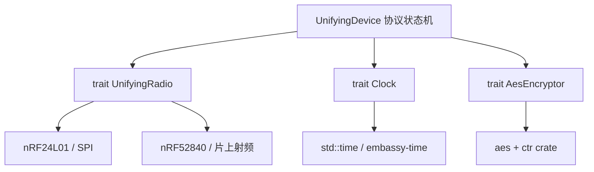
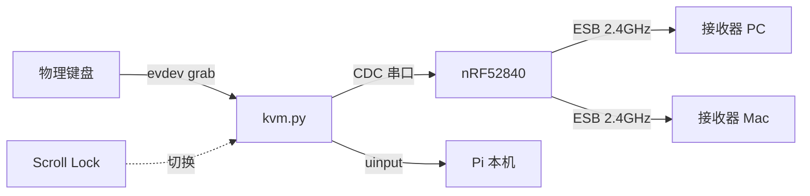

## 背景

我有一把 ikbc c87 的有线键盘，服役好多年了一直没坏，没动力换把新的。
但是我经常要在不同的设备间切换：PC / RPI / MBP。每次都将线插来插去的，很麻烦。

尝试弄了一个有线的 usb 切换器：


以为能彻底解决问题，结果发现桌面上多了很多线：
* 每个设备 1 条线 x 3
* 供电线 x1
* 切换按钮线 x1

这也太不优雅了吧。

那能不能将我的有线键盘变成无线键盘呢？

## 无线键盘协议

无线键盘主要有两种传输形式：蓝牙 和 2.4G 私有协议。

蓝牙的问题：容易被干扰、多设备切换慢（经常要等好几秒才连上）、需要目标电脑有蓝牙。

2.4G 私有协议各家有自己的方案。我的鼠标是罗技的，用的是优联（Unifying）接收器。优联接收器最多支持 6 个设备，一个 $10 的 USB dongle 插到电脑上就是即插即用，不需要装驱动。

那能不能**模拟一个优联键盘**，把我的有线键盘变成无线的呢？

## 优联协议

Logitech Unifying 是罗技在 2009 年推出的 2.4GHz 无线协议。一个接收器配对最多 6 个设备（键盘、鼠标、触控板），设备端用的是 Nordic 的 nRF24 系列芯片。

关键洞察：**优联的空中协议本质就是 Nordic Enhanced ShockBurst（ESB）**——也就是 nRF24L01+ 的那套协议。这意味着任何能跑 ESB 的射频芯片都能跟它通信。

安全研究社区在这个协议上已经深耕多年：

- 2016 年 Bastille Networks 的 [MouseJack](https://github.com/BastilleResearch/mousejack) 揭示了协议的安全弱点
- [KeySweeper](https://github.com/samyk/keysweeper) 展示了用 $10 硬件嗅探旧款键盘
- 后续罗技加入了 AES-128 加密，协议细节也通过 [HID++ 规范](https://drive.google.com/folderview?id=0BxbRzx7vEV7eWmgwazJ3NUFfQ28)公开

有一个 [C 语言实现](https://github.com/decrazyo/unifying) 在 Arduino + nRF24L01 上跑通了完整的配对和加密键击。我基于它用 Rust 的嵌入式生态重写了协议层（[rust-unifying](https://github.com/ZHLHZHU/rust-unifying)），架构上做了硬件无关的抽象：



协议逻辑（配对握手、AES 密钥派生、加密键击、保活、HID++ 应答）全部封在 `UnifyingDevice` 里，只通过三个 trait 触及硬件。这为后面的迁移省了大量工作——换硬件只需要重新实现一个 trait。

在树莓派上用外接 nRF24L01 模块验证了完整功能：配对、加密键击、保活。一切正常，但**一根 SPI 飞线连着一块绿色 PCB 挂在树莓派上**，实在不是长期方案。

## 迁移到 nRF52840 片上射频

nRF52840 的片上 2.4GHz RADIO 可以配置成与 nRF24L01+ 完全兼容的 ESB 模式——不需要外接任何射频模块。一块 U 盘大小的 nRF52840 dongle 直接插在 Pi 的 USB 口，整洁多了。

### 手写 ESB 驱动

现有的 `esb` crate（2020 年）跟 embassy 的 PAC 版本冲突，没法直接用。所以我对着 nRF52840 的 PAC 手写了一个最小的 ESB PTX（主发射端）驱动。关键配置：

- 2Mbit Nordic 私有模式
- 6-bit 长度字段 + 3-bit S1（PID + no_ack）
- CRC-16（多项式 0x11021，初值 0xFFFF）
- 大端、关闭白化

最难的坑是**地址编码**。nRF52 的 BASE/PREFIX 拆分方式、字节序、位序都跟 nRF24L01+ 不一样，有好几种"看似合理"的组合。

靠猜+重刷验证太慢（每轮 3 分钟）。我换了个思路：**在一份固件里同时内置 4 种候选编码**，加一条 `URADIOTEST` 诊断命令扫频统计 ACK 数，让接收器投票：

```
RADIOTEST ENC=0 ACKS=0
RADIOTEST ENC=1 ACKS=2   ← 就是它
RADIOTEST ENC=2 ACKS=0
RADIOTEST ENC=3 ACKS=0
```

一次性定位正确编码。

### 保活——让连接永不断

优联连接靠**持续不断的 keep-alive 包**维持跳频同步。真实键盘每 ~20ms 发一个保活包，一旦几秒没发，接收器就判定设备掉线。

最初我犯了个方向性错误：发送失败后调 `connect()` 重新扫频（事后自愈）。结果越改越差——多轮重试还互相打断接收器正在重建的同步。

正确方向是**从源头维持连接**：用 embassy 的 `select(read_packet, Timer::after(8ms))`，在等待下一条串口命令的同时穿插保活 tick。这正是真实键盘的做法——一直发，而不是断了再补。

修完用同样的"6 秒间隔"场景验证：

```
gap6s key#1..6 f5 -> OK (6/6)
CAPTURED: F5F5F5F5F5F5
```

6/6 全中。

### 端到端验证

ESB 收到 ACK 只能证明射频帧被接收器收到了，不能证明它被成功解密并注入。我用 Linux 的 `EVIOCGRAB` 独占抓取接收器的键盘事件节点：

```
UTYPE hello -> TYPED 5/5
CAPTURED: hello
```

整条链路全通：原生射频 → 配对 → AES 密钥派生 → 加密键击 → 接收器解密 → HID 注入。

## 上位机：KVM 转发器

固件通过 USB-CDC 串口暴露命令接口。上位机是一个 Python 脚本，用 `evdev` 抓取物理键盘，把每个按键状态变化转成 `UKEYDOWN` 命令转发给 nRF52。

### 架构



关键设计决策：

**始终 grab 键盘**：物理键盘永远被我们独占，本机模式通过 uinput 虚拟键盘注入。这保证了 LED 控制可靠（内核永远碰不到物理键盘的 LED 状态）。

**状态式报文**：每次按键变化发送**当前完整按住的键集**（`UKEYDOWN <modifier> [keycodes...]`），而不是增量的 press/release。这样丢一帧不会卡键——下一帧自动纠正。

**火力即忘（fire-and-forget）**：所有热路径的串口通信不等固件回复。固件在做扫频连接时 CDC 缓冲可能满,如果等回复会阻塞整个事件循环。丢一帧静默忽略,下一帧覆盖。

### 多设备切换

按 **Scroll Lock** 循环切换目标（PC → 本机 → Mac → PC ...）。切换时 Scroll Lock 灯闪烁指示当前目标（1闪=PC，2闪=本机，3闪=Mac）。

固件支持 4 个独立的配对 slot，`USWITCH` 命令加载对应 slot 的地址/AES 密钥/counter 并配置射频——整个过程零阻塞，后台 tick 自动在几百毫秒内找到信道。

## 持久化与防重放

优联用 AES-128-CTR 加密键击，每帧的 counter 单调递增。接收器记住见过的最大 counter，拒绝任何不大于它的帧（防重放）。

真实罗技键盘用电池供电，RAM 常驻，不需要存 counter 到 flash。但我的方案是 USB 供电——拔线就丢 RAM。所以需要往 flash 持久化 counter。

三重保护：

1. **启动前跳 +512**：每次从 flash 加载 counter 后立即加 512。即使断电前有未存的增量，512 的余量绝对够覆盖。对 u32（40 亿）完全可忽略。
2. **每 128 帧存一次**：正常打字约每 10-30 秒触发一次写入，flash 磨损极低。
3. **POFCON 掉电紧急存**：VDD 跌破 2.7V 时触发中断，几百微秒的窗口够写一条 32 字节记录。

为减少 flash 磨损，存储用追加式日志：一页 4K 分成 128 个槽位，每次追加一条，写满才擦页。

## 最终效果

```
┌─────────────────────────────────┐
│       物理键盘 (ikbc c87)        │
└──────────────┬──────────────────┘
               │ USB
┌──────────────▼──────────────────┐
│     树莓派 + nRF52840 dongle     │
│     (kvm.py + systemd 常驻)      │
└──────────────┬──────────────────┘
               │ 2.4GHz ESB
    ┌──────────┼──────────┐
    ▼          ▼          ▼
  [PC]      [Pi本机]    [MacBook]
```

- **切换延迟**：按 Scroll Lock → LED 闪 → 打字即达（< 300ms）
- **输入延迟**：端到端 3-8ms，人完全无感
- **回报率**：~150Hz，日常打字绰绰有余
- **CPU 占用**：0%（epoll 阻塞，不轮询）
- **成本**：Pi Zero (~$5) + nRF52840 dongle (~$8) + 优联接收器 (~$10×2) ≈ **$33**

对比：USB KVM 切换器 $50+，IP KVM $200+，蓝牙多设备键盘 $100+。而且这些方案都需要特定硬件或驱动——我的方案对目标电脑完全透明，它只看到一个"罗技键盘"。

## 复现

硬件清单：
- 树莓派（任意型号，需 USB 口）
- nRF52840 开发板/dongle（支持 USB CDC）
- Logitech Unifying 接收器（046d:c52b），每台远程电脑一个

```bash
# 克隆项目
git clone --recursive https://github.com/ZHLHZHU/nrf52-unifying.git
git clone https://github.com/ZHLHZHU/unifying-kvm.git

# 编译固件
cd nrf52-unifying
cargo build -p nrf-demo-app --release

# 首次 SWD 烧录后,后续走 OTA
python3 tools/cdc_dfu.py --port /dev/ttyACM0 --image app.bin

# 配对接收器(接收器侧先进入配对模式)
python3 tools/unifying.py raw "UPAIR 00"   # PC
python3 tools/unifying.py raw "UPAIR 01"   # Mac

# 启动 KVM
sudo python3 unifying-kvm/kvm.py --keyboard VID:PID --targets "pc:0,local:_,mac:1"
```

开机自启：项目带 systemd service 文件，`systemctl enable unifying-kvm` 即可。

## 写在最后

整个项目的代码量不大（固件 ~800 行 Rust，KVM ~400 行 Python），但涉及的层次很多：USB CDC、embedded Rust、射频协议、AES 加密、flash 持久化、Linux evdev/uinput、systemd。最有意思的部分是射频层——把一个"不确定正确编码"的问题塞进一份固件让硬件投票，以及从"事后自愈"走错路到"源头保活"的认知转折。

三个仓库都在 GitHub 上,欢迎 star / issue:

- [nrf52-unifying](https://github.com/ZHLHZHU/nrf52-unifying) — nRF52840 固件
- [rust-unifying](https://github.com/ZHLHZHU/rust-unifying) — 优联协议库
- [unifying-kvm](https://github.com/ZHLHZHU/unifying-kvm) — 键盘 KVM 转发器

---

> 本项目仅供个人学习和自用设备互操作。Logitech、Unifying 是罗技的注册商标。协议细节参考自公开的安全研究文献。
